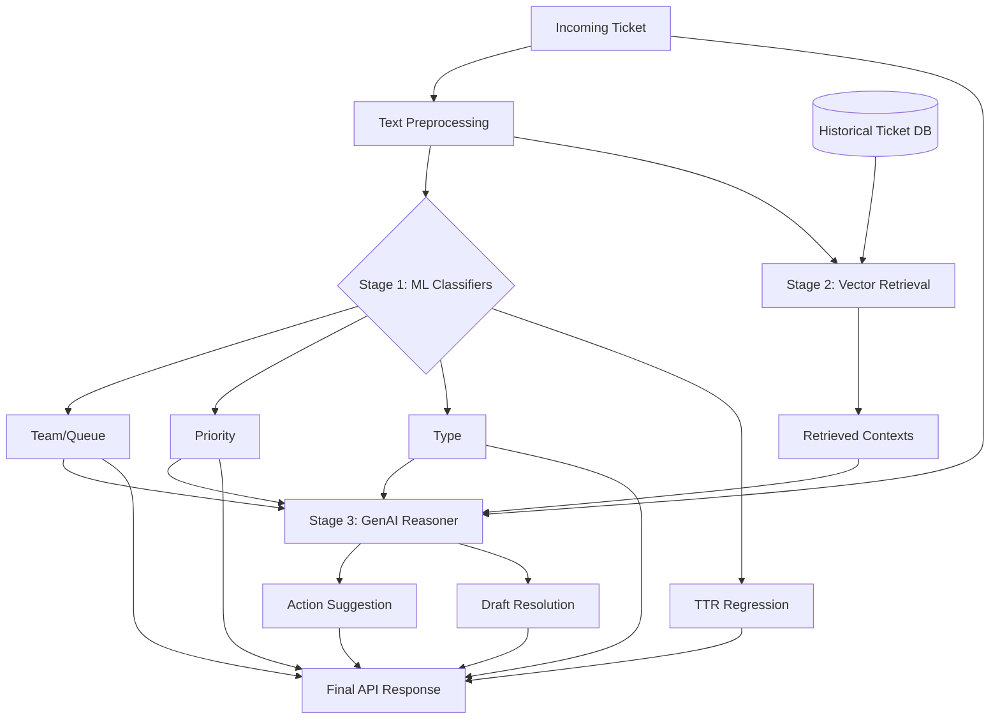

# Architecture Design: Hybrid Ticket Intelligence System

This document describes the high-level architecture for the enhanced ticket classification system, integrating traditional machine learning with Generative AI and RAG.

## System Overview

The system follows a "classify then augment" approach. Fast, discriminative models handle structured metadata (Team, Priority, Type), while a generative model handles more complex reasoning (Action, Resolution Suggestions).

## Component Diagram

## Key Components

### 1. Traditional ML Layer
- **Technology**: Scikit-Learn (LinearSVC, Ridge).
- **Purpose**: Fast and accurate classification of discrete labels.
- **Input**: TF-IDF vectorized features.

### 2. Retrieval Layer (RAG)
- **Technology**: FAISS/ChromaDB + Sentence Transformers (e.g., `all-MiniLM-L6-v2`).
- **Data**: Historical tickets from `ultra_synthetic_200k_v2.csv` (specifically `clean_text` and `action/answer`).
- **Function**: Find the top 3-5 most similar tickets to the current one.

### 3. Generative Layer
- **Technology**: OpenAI GPT or local Llama via LangChain.
- **Prompt Strategy**: 
    - "You are a senior support engineer. Given the following ticket and these similar historical cases, what is the best next action?"
- **Output**: Natural language action suggestion.

## Logic Flow for "Action"
The user's request specifically highlights the `Action` feature using GenAI/RAG. By combining the predicted `Type` and `Priority` with retrieved historical `Actions`, the LLM can provide a much more nuanced suggestion than a simple 12-class classifier.
